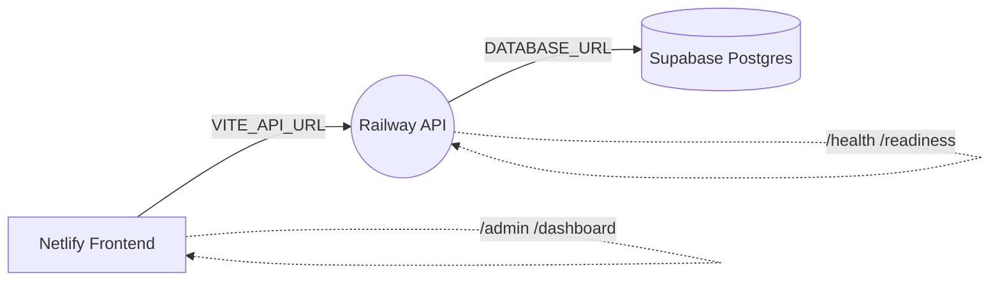

# 🚀 UBAS Quick Deploy: Visual, Step‑by‑Step (Free Tier)

This is a friendly, copy‑paste guide to get the live stack up in minutes using free tiers.

Stack chosen:

- Database: Supabase (Postgres)
- Backend API: Railway (Node/Express in `server/`)
- Frontend: Netlify (Vite/React in repo root)

---

## 0) What we’re building



Env keys you’ll set:

- Backend (Railway): `DATABASE_URL`, `JWT_SECRET`, `JWT_REFRESH_SECRET`, `SESSION_SECRET`, `ALLOWED_ORIGINS`, `NODE_ENV`, `PORT`
- Frontend (Netlify): `VITE_API_URL`, `VITE_SOCKET_URL`

---

## 1) Create the database (Supabase)

1. Go to [supabase.com](https://supabase.com) → New project → Create Postgres DB
2. In Project Settings → Database → copy `Connection string` (Postgres). This is your `DATABASE_URL`.
3. Keep the project open—you’ll need the URL shortly.

---

## 2) Deploy the backend (Railway)

We’ll deploy the `server/` folder as a Railway service.

- Install & login (one time):

```bash
npm i -g @railway/cli
railway login
```

- Initialize Railway in the `server/` folder and deploy:

```bash
cd server
railway init     # select or create a project
railway variables set \
  NODE_ENV=production \
  PORT=3000 \
  DATABASE_URL="postgres://<from-supabase>" \
  JWT_SECRET="$(openssl rand -hex 32)" \
  JWT_REFRESH_SECRET="$(openssl rand -hex 32)" \
  SESSION_SECRET="$(openssl rand -hex 32)" \
  ALLOWED_ORIGINS="https://<your-netlify-domain>"

# Build & deploy
railway up
```

- Verify health:

```bash
# Find your deployed URL in the Railway dashboard
curl -fsS https://<railway-app-domain>/health
curl -fsS https://<railway-app-domain>/health/readiness
```

If readiness isn’t 200, check Railway logs and confirm `DATABASE_URL` is correct.

---

## 3) Wire the frontend (Netlify)

1. In Netlify → Site settings → Build & deploy → Environment:
   - `VITE_API_URL=https://<railway-app-domain>/api/v1`
   - `VITE_SOCKET_URL=https://<railway-app-domain>` (if using sockets)
2. Redeploy the site (or trigger a new deploy on push).

\- Optional CLI deploy

```bash
npm i -g netlify-cli
netlify login
npm run build
netlify deploy --prod --dir=dist
```

---

## 4) Smoke test the live stack

```bash
# API health
curl -fsS https://<railway-app-domain>/health
curl -fsS https://<railway-app-domain>/health/readiness

# End‑to‑end system check from repo root
export api_url="https://<railway-app-domain>/api/v1"
node scripts/system-check.mjs
```

Visit:

- Admin: `https://<your-netlify-domain>/admin`
- Dashboard: `https://<your-netlify-domain>/dashboard`

---

## 5) Common fixes (1‑minute)

- 401s after a while → ensure refresh tokens work and time is correct on server. Re‑login.
- CORS blocked → add your exact Netlify/custom domain to `ALLOWED_ORIGINS` (comma‑separated; no spaces).
- Readiness failing → run migrations automatically (already via `start:deploy`) and verify `DATABASE_URL`.
- Cold starts → first request can be slow on free tiers.

---

## 6) Optional admin bootstrap

If you need a guaranteed admin on first run, set these Railway variables before first deploy:

- `ADMIN_EMAIL=admin@example.com`
- `ADMIN_PASSWORD=AdminPass#123`
- `ADMIN_FIRST_NAME=Platform`
- `ADMIN_LAST_NAME=Administrator`
- `ADMIN_PHONE=+10000000000`

---

## 7) Visual checklist

- [ ] Supabase DB created; `DATABASE_URL` copied
- [ ] Railway service created from `server/` and deployed
- [ ] Railway variables set (JWT/SESSION secrets, origins)
- [ ] Netlify `VITE_API_URL` points to Railway API `/api/v1`
- [ ] Health checks return 200
- [ ] System check passes
- [ ] Admin login works

You’re live. If something fails, grab the error and I’ll pinpoint the fix.

---

## Appendix: Fly.io (Docker) instead of Railway

If you prefer Docker + Fly.io, use this instead of Section 2.

1) Install & login

```bash
curl -L https://fly.io/install.sh | sh
fly auth login
```

1) Launch and configure (from `server/`)

```bash
cd server
fly launch --no-deploy --copy-config

# Set secrets (paste your values)
fly secrets set \
  DATABASE_URL="postgres://<from-supabase>" \
  JWT_SECRET="$(openssl rand -hex 32)" \
  JWT_REFRESH_SECRET="$(openssl rand -hex 32)" \
  SESSION_SECRET="$(openssl rand -hex 32)" \
  ALLOWED_ORIGINS="https://<your-netlify-domain>"

# Deploy (Dockerfile is used; fly.toml included)
fly deploy
```

The `fly.toml` config runs `npm run migrate:prod` as a release command to apply DB migrations during deployment.

1) Verify health

```bash
fly status
curl -fsS https://<fly-app-name>.fly.dev/health
curl -fsS https://<fly-app-name>.fly.dev/health/readiness
export api_url="https://<fly-app-name>.fly.dev/api/v1"
node scripts/system-check.mjs
```
